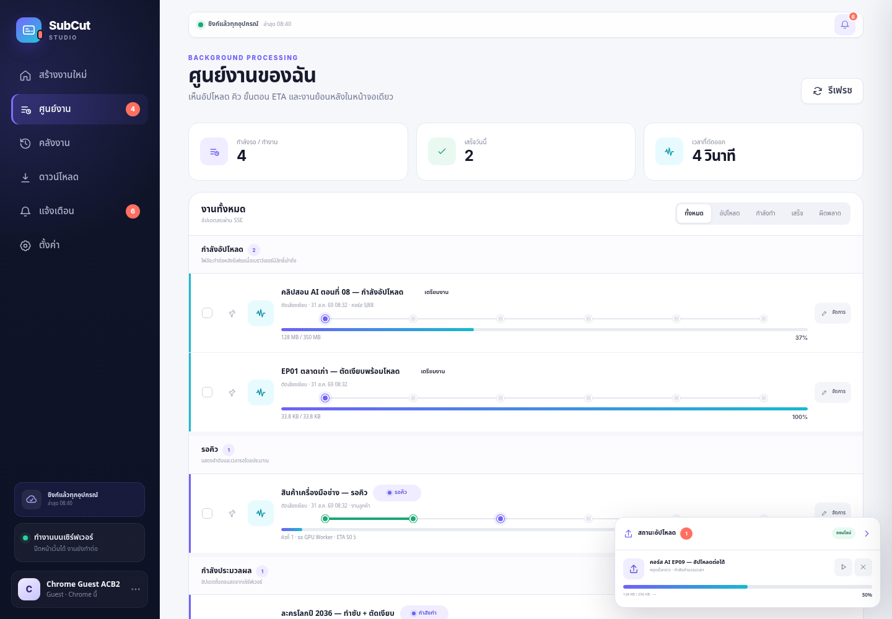

# SJ88 SubCut Studio 2.3 — Bold Workspace

เว็บสำหรับ **ทำซับไตเติ้ล**, **ตัดเสียงเงียบ** และจัดการไฟล์ผลลัพธ์แบบครบวงจร เปิดเว็บแล้วใช้งานได้ทันทีด้วย Guest ที่ผูกกับ Chrome สมัครสมาชิกภายหลังได้โดยงานเดิมไม่หาย



## สิ่งที่เพิ่มในรุ่น Bold

- **Upload Dock ติดหน้าจอ:** เปอร์เซ็นต์, ความเร็ว, ETA, Pause/Resume และกู้ Upload หลังรีเฟรชผ่าน IndexedDB
- **ศูนย์งาน:** แยกกำลังอัปโหลด, รอคิว, กำลังประมวลผล, สำเร็จ และผิดพลาด พร้อม Step Timeline ผ่าน SSE
- **คลังงาน:** ค้นหา/กรอง/เรียง, Pin, Favorite, Folder, Tag, Rename, Duplicate, Retry, Delete และ Bulk actions
- **Download Center:** รวม MP4/SRT/VTT/ASS/ZIP, แสดงพื้นที่และระยะเก็บไฟล์ พร้อมขยายเวลาเก็บ
- **Preview + Waveform:** ดูต้นฉบับ/ผลลัพธ์, Seek, เปิด–ปิดตัวอย่างซับ และทดลองตัดช่วง 10/15/20 วินาที
- **Subtitle Editor Lite:** แก้เวลา/ข้อความ, เพิ่ม–ลบ Cue, เลื่อนเวลาทั้งไฟล์, Import/Export SRT/VTT/ASS
- **Notification Center:** งานเสร็จ/ผิดพลาด/ความปลอดภัย, unread badge, กรองและ mark read; Browser Notification เมื่ออนุญาตและหน้าเว็บเปิดอยู่
- **Sync หลายอุปกรณ์:** Member ล็อกอินได้ทุกเครื่อง; Guest ใช้ Recovery Code แบบครั้งเดียว เพิ่ม/เปลี่ยนชื่อ/ถอนอุปกรณ์ได้
- **Storage Dashboard:** Source, Output, Upload, Cache, โควตาใช้แล้ว/คงเหลือ
- **Background Worker:** ปิดหน้าเว็บได้ งานยังทำต่อ พร้อม lease, heartbeat, cancellation และ recovery

## เริ่มใช้งานเร็ว

ต้องมี Python 3.11–3.12, FFmpeg/FFprobe และ NVIDIA/CUDA เมื่อต้องการใช้ Whisper บน GPU

### macOS / Linux

```bash
./scripts/install.sh
./scripts/start.sh
```

### Windows

```bat
scripts\install.bat
scripts\start.bat
```

เปิด `http://127.0.0.1:8787` แล้วลากวิดีโอเข้าได้ทันที สคริปต์ติดตั้งจะสร้าง `APP_AUTH_SECRET` และ `APP_BROWSER_IDENTITY_SECRET` ให้โดยอัตโนมัติ

## Production: แยก Web / Worker

แก้ `APP_ENABLE_WORKER=0` ใน `app/.env` แล้วเปิดสองโปรเซส:

```bash
./scripts/start.sh
./scripts/start-worker.sh
```

Windows ใช้ `scripts\start.bat` และ `scripts\start-worker.bat`

### Docker Compose

```bash
cp app/.env.example app/.env
python scripts/prepare_env.py app/.env
docker compose -f deploy/docker-compose.yml up --build -d
```

สำหรับ NVIDIA Container Toolkit ให้เพิ่ม `gpus: all` ใน service `worker` และติดตั้ง PyTorch build ที่ตรงกับ CUDA

## Guest และการซิงก์

- Chrome/Profile เดิมเห็นงานเดิมอัตโนมัติผ่าน HttpOnly Cookie + Browser Key
- Recovery Code ใช้ได้ครั้งเดียวและมีวันหมดอายุ เหมาะสำหรับย้าย Guest ไป Chrome/เครื่องใหม่
- สมัครสมาชิกเป็นการอัปเกรด Guest เดิม จึงคง `user_id`, คิว, ประวัติ และ Workspace
- สมาชิกล็อกอินจากหลายอุปกรณ์แล้วเห็นข้อมูลเดียวกัน
- ห้ามเปลี่ยน `APP_BROWSER_IDENTITY_SECRET` หลังใช้งานจริงโดยไม่มีแผน migration

## ค่าที่ควรตั้งก่อนเปิด Public

```env
APP_AUTH_SECRET=<random-secret>
APP_BROWSER_IDENTITY_SECRET=<stable-random-secret>
APP_STORAGE_QUOTA_BYTES=21474836480
APP_OUTPUT_RETENTION_DAYS=7
APP_OUTPUT_RETENTION_EXTENSION_MAX_DAYS=365
APP_WORKER_MAX_CONCURRENCY=1
```

ค่า LINE/Email ในหน้าตั้งค่าถูกเก็บเป็น preference สำหรับต่อ provider ขององค์กร ส่วน Browser Notification ทำงานในเบราว์เซอร์เมื่อผู้ใช้อนุญาต

## ทดสอบ

```bash
python -m pytest -q tests
python -m compileall -q app scripts tests
node --check app/frontend/static/app.js
node --check app/frontend/static/bold-core.js
node --check app/frontend/static/subtitle-editor.js
```

หลักฐาน QA อยู่ใน `qa/`: API JSON, test matrix, UI/API pairs และภาพ Desktop/Mobile

## โครงสร้าง

```text
app/
  backend/                 FastAPI, Auth, Hub, Worker, FFmpeg/Whisper
  frontend/static/         UI แบบไม่ต้อง Build
  main.py                  Web entry point
  worker_main.py           Worker entry point
scripts/                   install/start/tests/env preparation
deploy/                    Dockerfile, Compose, systemd
docs/                      API, Architecture, Migration, Operations
qa/                        รายงานและหลักฐานทดสอบ
```
